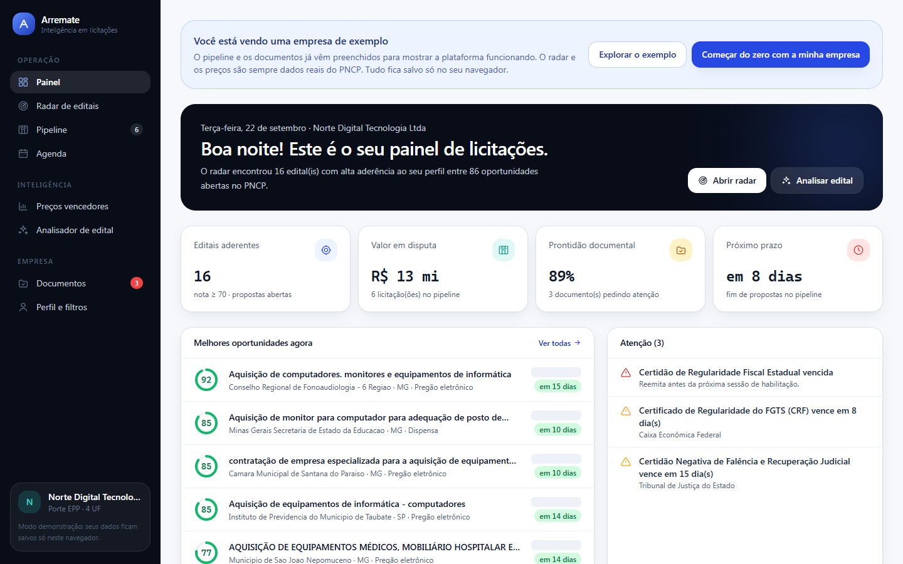
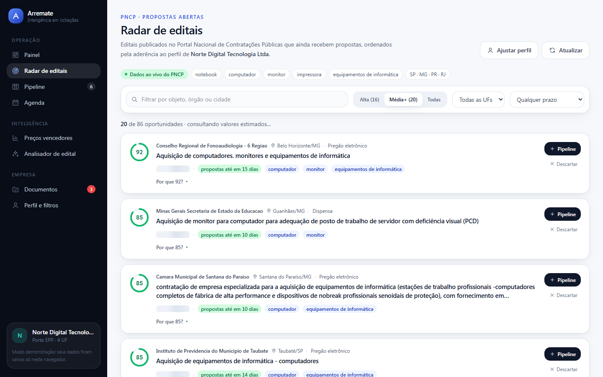
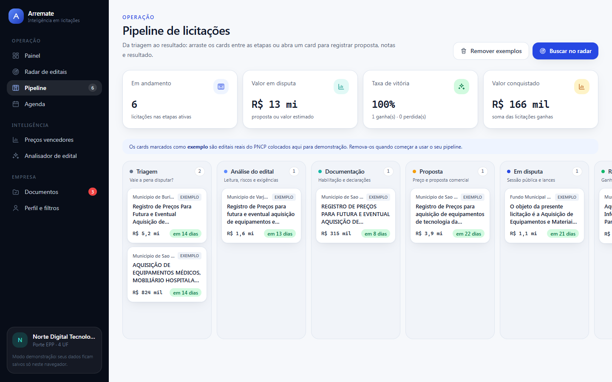

# LicitaFlow · Inteligência em licitações

    

**🔗 Demo ao vivo: [automation-bidding.vercel.app](https://automation-bidding.vercel.app)** · sem cadastro, os dados ficam no seu navegador.



| Radar de editais (PNCP ao vivo) | Pipeline de licitações |
| --- | --- |
|  |  |

Plataforma web para empresas que vendem para o governo. Ela cobre o ciclo inteiro de uma licitação, do edital encontrado ao resultado, com **dados reais do PNCP** (Portal Nacional de Contratações Públicas) e **IA** para ler editais.

| Módulo | Rota | O que resolve |
| --- | --- | --- |
| **Painel** | `/` | Visão do dia: editais aderentes, valor em disputa, prontidão documental, próximos prazos e alertas |
| **Radar de editais** | `/radar` | Varre o PNCP pelos termos do perfil e dá a cada edital aberto uma **nota de aderência de 0 a 100 com a conta aberta** |
| **Oportunidade** | `/radar/{cnpj}/{ano}/{seq}` | Dados da contratação, itens com valor estimado, itens exclusivos ME/EPP e arquivos do edital |
| **Analisador de edital** | `/analisador` | Baixa o PDF do edital direto do PNCP (ou recebe um upload) e gera um relatório executivo com IA |
| **Preços vencedores** | `/precos` | Mostra **por quanto** itens parecidos foram vencidos: mediana, faixa competitiva, desconto sobre o estimado e quem mais vence |
| **Pipeline** | `/pipeline` | Kanban da triagem ao resultado, com valor da proposta, notas e taxa de vitória |
| **Documentos** | `/documentos` | Cofre de certidões com controle de validade. Certidão vencida é uma das principais causas de inabilitação |
| **Agenda** | `/agenda` | Prazos de propostas e vencimentos de documentos num só calendário |
| **Perfil** | `/perfil` | Produtos, termos excluídos, UFs, modalidades e faixa de valor que alimentam o radar |

> **Apoio à decisão.** Nada aqui é parecer jurídico. A plataforma organiza informação pública e aponta o que merece atenção; a decisão de participar é sempre humana.

---

## Fluxo de uso

```
 Radar ──► Oportunidade ──► Analisar edital (IA) ──► Preços vencedores ──► Pipeline ──► Resultado
   ▲                                                                            │
   └──────────── Perfil (termos, UFs, valor)          Documentos + Agenda ◄─────┘
```

1. **Encontrar**: o radar busca os editais com propostas abertas e ordena pela nota de aderência.
2. **Entender**: um clique baixa o edital do PNCP e o envia ao pipeline de IA (prazos, habilitação, riscos, checklist).
3. **Precificar**: a tela de preços lê licitações já encerradas e devolve os preços **homologados**, ou seja, o valor que de fato venceu.
4. **Disputar**: o pipeline, o cofre de documentos e a agenda garantem que nenhum prazo nem certidão escape.

---

## Integração com o PNCP

Todos os endpoints são públicos e sem chave.

| Uso | Endpoint |
| --- | --- |
| Busca de editais abertos/encerrados | `GET /api/search/?q=…&status=recebendo_proposta\|encerradas&ufs=…&modalidades=…` |
| Itens (valor estimado, benefício ME/EPP) | `GET /api/pncp/v1/orgaos/{cnpj}/compras/{ano}/{seq}/itens` |
| Resultado do item (vencedor, porte, preço homologado) | `GET /api/pncp/v1/…/itens/{n}/resultados` |
| Arquivos (PDF do edital) | `GET /api/pncp/v1/…/arquivos` |
| Detalhe da compra (amparo legal, processo) | `GET /api/consulta/v1/orgaos/{cnpj}/compras/{ano}/{seq}` |

### Decisões tomadas por causa do comportamento real da API

O PNCP é gratuito, mas instável. Durante o desenvolvimento ele devolveu 502 esporádicos, derrubou conexões e **bloqueou o IP por minutos** depois de rajadas de requisições. A plataforma foi desenhada em torno disso:

- **Cliente único** (`src/lib/pncp/client.ts`) com timeout, retentativa com backoff só para 5xx/rede (nunca para 429, que prolonga o bloqueio), deduplicação de chamadas simultâneas e cache em memória.
- **Concorrência limitada** (`mapLimit`, 3 a 5 chamadas paralelas).
- **O valor estimado vem da soma dos itens**, não do endpoint `/consulta`, que aplica limite agressivo (HTTP 429). A tela o carrega depois, em lotes, e o radar aparece em ~2 s.
- **Disjuntor** no `/consulta`: após uma falha, ele não é chamado por 5 minutos e a página de detalhe segue com os dados da busca e dos itens.
- **Preços em streaming (NDJSON)**: o endpoint de resultados leva de 2 a 6 s por item, então as amostras aparecem na tela conforme chegam.
- **Amostra real de reserva** (`src/lib/fixtures/pncp-amostra.json`): se o PNCP estiver fora do ar, radar e preços usam uma captura real anterior, **sempre sinalizada na interface**. A amostra também monta o pipeline de exemplo da primeira visita. Para atualizá-la: `npm run dev` e depois `node scripts/capturar-amostra-pncp.mjs http://localhost:3000`.

### Nota de aderência (0–100), auditável

Cada ponto vem de um fator nomeado, e a interface mostra a conta ("Por que 93?").

| Fator | Máx. | Regra |
| --- | --- | --- |
| Objeto | 45 | 1º termo do perfil no objeto = 30; cada termo extra +7,5 |
| Região | 15 | UF na área de atuação = 15 · perfil nacional = 10 · fora = 0 |
| Valor | 15 | dentro da faixa = 15 · abaixo do mínimo = 5 · acima da capacidade = 3 · não informado = 7 (neutro) |
| Prazo | 15 | ≥ 7 dias = 15 · 3–6 = 11 · 1–2 = 6 · < 24 h = 2 · encerrado = 0 |
| Modalidade | 10 | preferida = 10 · outra = 4 |

Travas: termo excluído limita a nota a 10, contratação cancelada a 5, e sem nenhum termo no objeto a nota não passa de 35.

### Preços vencedores: como a amostra é filtrada

Um item só entra quando **todas** as palavras da consulta aparecem na descrição **e** a primeira abre a descrição (1ª ou 2ª palavra, ignorando "Lote 1 –"). Sem essa âncora, "Base cooler para notebook" entraria como preço de notebook. As estatísticas usam só a unidade predominante (UN, CX…), e as demais amostras aparecem na tabela com aviso.

---

## Arquitetura da plataforma

```
src/
├── app/
│   ├── (plataforma)/            # grupo de rotas com a barra lateral
│   │   ├── page.tsx             # Painel
│   │   ├── radar/               # Radar + detalhe da oportunidade
│   │   ├── precos/ pipeline/ documentos/ agenda/ perfil/
│   │   └── analisador/          # Analisador de editais (aceita ?pncp=cnpj/ano/seq)
│   ├── analise/[id]/            # Relatório da análise
│   └── api/
│       ├── radar/               # busca + deduplicação por termo
│       ├── precos/              # coleta de preços em NDJSON
│       └── pncp/                # compra, valores, analisar (baixa o PDF e chama a IA)
├── components/plataforma/       # telas, shell, workspace e UI compartilhada
└── lib/
    ├── pncp/                    # cliente HTTP, normalização, radar, preços, amostra
    └── plataforma/              # regras puras: aderência, preços, documentos, agenda, formatação
```

- **Regras de negócio são funções puras** em `src/lib/plataforma`, com testes unitários.
- **Workspace no navegador**: perfil, pipeline e documentos ficam no `localStorage`, versionados. Assim qualquer pessoa abre o link e usa a plataforma sem cadastro, e nenhum dado de empresa vai para o servidor. Trocar por Supabase/Postgres com login é trocar o adaptador (`workspace-provider.tsx`), não o modelo.
- **A nota é calculada no cliente**: o servidor faz só o trabalho caro (buscar e deduplicar), e a mesma resposta em cache serve perfis diferentes.

---

## Demonstração em ~90 segundos

| Tempo | Tela | O que mostrar |
| --- | --- | --- |
| 0–15 s | Painel | Editais aderentes hoje, valor em disputa, certidões vencendo |
| 15–35 s | Radar | Dados ao vivo do PNCP, nota de aderência, abrir "Por que 93?" |
| 35–55 s | Oportunidade → **Analisar edital com IA** | O PDF sai do PNCP direto para o relatório executivo |
| 55–75 s | **Quanto ofertar?** | Mediana, faixa competitiva, desconto médio e quem mais vence |
| 75–90 s | Pipeline e Documentos | Arrastar um card, ver a certidão vencida e o botão "Emitir" |

---

# Módulo: Analisador Inteligente de Editais

Aplicação web que recebe um **edital de licitação em PDF**, extrai o texto, analisa o documento com **IA (DeepSeek)** e devolve um **relatório executivo estruturado** — prazos, valores, exigências de habilitação, obrigações, pontos de atenção priorizados e checklist de participação — pronto para leitura em tela e **download em PDF profissional (A4)**.

> **Ferramenta de apoio à decisão.** Não constitui parecer jurídico e não substitui a leitura integral do edital nem a validação por profissional habilitado. O sistema nunca declara que uma empresa "pode" ou "não pode" participar.

---

## 1. Objetivo

Uma empresa que participa de licitações gasta horas lendo editais de 60, 120, 300 páginas para descobrir, no fim, se vale a pena disputar. O Analisador Inteligente de Editais resolve isso em minutos:

| Entrada | Processamento | Saída |
| --- | --- | --- |
| PDF do edital (até 25 MB) | Extração com paginação → análise por IA → validação por schema | Dashboard + relatório PDF A4 com 10 seções |

O projeto foi construído para demonstração comercial: funciona de ponta a ponta, tem modo de demonstração em 1 clique, trata erros de forma elegante e **nunca inventa informação** (ver seção 6).

---

## 2. Experiência de uso

1. Usuário abre a aplicação e vê a proposta de valor e a área de upload.
2. Arrasta o PDF **ou** clica em **"Analisar edital de demonstração"** (edital fictício completo embutido no projeto).
3. Acompanha as cinco etapas, com progresso, detalhes técnicos e console de eventos em tempo real:
   **Documento recebido → Extraindo conteúdo → Analisando edital → Estruturando informações → Gerando relatório**
4. Cai no dashboard com KPIs (prazo crítico, valor, órgão, modalidade, itens, pontos de atenção) e o relatório completo.
5. Baixa o **PDF do relatório** ou abre a versão de impressão.

---

## 3. Arquitetura

```
┌──────────────────────────────────────────────────────────────────────┐
│  Browser (React 19 · Next.js App Router · Tailwind CSS v4)           │
│  · Landing + upload (drag & drop, validação no cliente)              │
│  · Timeline de progresso consumindo Server-Sent Events               │
│  · Dashboard/relatório, sumário com scroll-spy, download do PDF      │
└───────────────────────────┬──────────────────────────────────────────┘
                            │ HTTP · SSE · multipart/form-data
┌───────────────────────────▼──────────────────────────────────────────┐
│  Servidor Next.js (Route Handlers, runtime Node)                     │
│                                                                      │
│  1. Validação do upload     tamanho, MIME, assinatura %PDF-          │
│  2. Extração (unpdf/pdf.js) texto página a página + paginação        │
│  3. Chunking                blocos por página, com sobreposição      │
│  4. Análise                 DeepSeek (JSON mode) — mapa + redução    │
│  5. Normalização + Zod      status found/inferred/not_found          │
│  6. Relatório               HTML de impressão autocontido            │
│  7. PDF                     navegador headless (Edge/Chrome)         │
│                                                                      │
│  Store em memória (jobs + resultados) · TTL 6h · 40 jobs             │
└──────────────────────────────────────────────────────────────────────┘
```

### Pipeline de análise (documentos longos)

Documentos pequenos vão inteiros em **uma única chamada**. Documentos longos passam por **mapa-redução**, sem corte arbitrário de texto:

```
PDF → páginas → blocos (≈14.000 caracteres, respeitando limites de página)
                      │
        ┌─────────────┼─────────────┐   (paralelismo configurável)
        ▼             ▼             ▼
   extração 1    extração 2    extração N     ← IA lê só o seu bloco
        └─────────────┼─────────────┘
                      ▼
        índice de páginas + extrações parciais
                      ▼
             SÍNTESE FINAL (IA)  →  JSON único validado por Zod
```

Ganhos dessa escolha:

- **nada de truncar** o edital: todas as páginas são lidas;
- **rastreabilidade**: cada bloco sabe de quais páginas veio;
- **contexto nas fronteiras**: blocos vizinhos compartilham sobreposição;
- **conflitos explícitos**: se dois trechos divergirem, o modelo é instruído a manter os dois e sinalizar em "Pontos de Atenção".

### Modo demonstração local

Sem `DEEPSEEK_API_KEY`, a aplicação **não quebra e não finge**: ela usa um motor determinístico de extração por padrões (`src/lib/ai/local.ts`) e **avisa na interface e no relatório** que a análise local está ativa. Com a chave configurada, o mesmo fluxo passa a usar a IA.

---

## 4. Tecnologias

| Camada | Escolha | Por quê |
| --- | --- | --- |
| Framework | **Next.js 15** (App Router) + **React 19** | Um único deploy para UI e API; Route Handlers no runtime Node |
| Linguagem | **TypeScript** estrito | Contrato de dados verificável ponta a ponta |
| Estilo | **Tailwind CSS v4** (config CSS-first via `@theme`) | Design system coeso, sem CSS morto |
| Validação | **Zod 4** | Schema rígido da resposta do modelo |
| Extração de PDF | **unpdf** (build serverless do pdf.js) | Sem binário nativo, preserva paginação |
| IA | **API DeepSeek** (compatível com OpenAI, `response_format: json_object`) | JSON mode nativo, bom custo em português |
| Relatório PDF | **HTML de impressão + navegador headless** (Edge/Chrome) | Qualidade tipográfica real, sem Chromium empacotado |
| PDF de teste | Gerador próprio (`src/lib/pdf/builder.ts`) | Edital de demonstração versionado em texto, sem binário no repositório |
| Testes | Node puro + API do TypeScript | Roda sem bundler e sem processos filhos |

Nenhuma dependência foi incluída sem necessidade: são **6 dependências de produção**.

---

## 5. Como instalar e executar

### Pré-requisitos

- **Node.js 20.11+** (testado em 24.x)
- **npm 10+**
- Opcional: **Microsoft Edge** ou **Google Chrome** instalado (para o download automático do PDF do relatório)

### Passo a passo

```bash
# 1. instalar dependências
npm install

# 2. configurar o ambiente
copy .env.example .env.local     # Windows
# cp .env.example .env.local     # macOS/Linux
# edite .env.local e informe DEEPSEEK_API_KEY

# 3. desenvolvimento
npm run dev            # http://localhost:3000

# 4. produção
npm run build
npm run start          # http://localhost:3000
```

Abra `http://localhost:3000/analisador`, clique em **Analisar edital de demonstração** e o fluxo completo roda em ~1–3 segundos.

### Scripts disponíveis

| Comando | O que faz |
| --- | --- |
| `npm run dev` | Servidor de desenvolvimento na porta 3000 |
| `npm run build` / `npm run start` | Build e execução em produção |
| `npm run typecheck` | Verificação de tipos (`tsc --noEmit`) |
| `npm run test:unit` | 39 testes unitários do núcleo (extração, chunking, normalização, motor local, relatório, validação de upload) |
| `npm run test:routes` | 13 verificações dos contratos que as rotas expõem (ciclo de vida do job, cache por hash, relatório) |
| `npm run test:css` | Auditoria estática do design system: confirma que **toda** classe utilitária usada gera CSS |
| `npm run test:e2e` | Teste ponta a ponta contra o servidor HTTP real |
| `npm run verify` | Executa o pipeline completo e gera artefatos de inspeção em `test-output/` |
| `npm test` | `typecheck` + `test:unit` + `test:routes` + `test:css` |

---

## 6. Variáveis de ambiente

Todas em `.env.example`, lidas **apenas no servidor**.

### Provedor de IA

A análise usa qualquer API no formato da OpenAI. A ordem de preferência é:

1. **`DEEPSEEK_API_KEY`**: DeepSeek V4.1 Flash, com janela de 1 milhão de tokens. O edital inteiro vai numa chamada só (cerca de 45 s e US$ 0,02 por edital).
2. **`GEMINI_API_KEY`**: camada gratuita do Google AI Studio, também com 1 milhão de tokens, mas sujeita a sobrecarga nos horários de pico. Um modelo sobrecarregado (503/429) passa para os de `GEMINI_MODELOS_RESERVA`.
3. **Sem chave**: motor local de demonstração, sinalizado na tela.

Se a IA não responder dentro de `AI_ORCAMENTO_TOTAL_MS`, o relatório sai pelo motor local com um aviso, em vez de erro. Quando o modelo omite o checklist ou os próximos passos, eles são montados a partir dos documentos de habilitação e do cronograma já extraídos, com a página de origem.

### Cota de análises com IA

A demonstração é pública, então cada pessoa tem **3 análises novas a cada 3 dias** e a demo inteira tem um teto diário (`AI_LIMITE_POR_USUARIO`, `AI_JANELA_HORAS`, `AI_LIMITE_DIARIO`).

- **Pessoa = IP ou navegador.** A contagem soma o que bater em qualquer um dos dois, então trocar só a rede ou só limpar o navegador não zera a cota.
- **Persistente:** o registro fica no Supabase (`supabase/migrations/…_arremate_cota.sql`), num schema fora da API REST, acessível só por funções que exigem `ARREMATE_SEGREDO`. O banco recebe apenas hashes com sal (`ARREMATE_SAL_IP`), nunca o IP.
- **Justo:** o mesmo PDF vem do cache e não gasta cota; análises que não chegaram a usar a IA (PDF inválido, provedor fora do ar) são estornadas.
- **A tela mostra quantas restam** e quando a próxima libera. Sem banco configurado, cai para um contador em memória.

> Por que não a Groq? A camada gratuita limita a **8 mil tokens por minuto**, e só a resposta de uma análise completa passa de 12 mil.

### Obrigatórias para a análise com IA

| Variável | Padrão | Descrição |
| --- | --- | --- |
| `DEEPSEEK_API_KEY` ou `GEMINI_API_KEY` | *(vazio)* | Chave do provedor de IA. **Sem nenhuma, a aplicação roda no modo de demonstração local.** |

### IA

| Variável | Padrão | Descrição |
| --- | --- | --- |
| `DEEPSEEK_BASE_URL` | `https://api.deepseek.com` | Endpoint compatível com a API OpenAI |
| `DEEPSEEK_MODEL` | `deepseek-chat` | Modelo da análise/leitura |
| `DEEPSEEK_SYNTHESIS_MODEL` | = `DEEPSEEK_MODEL` | Modelo da síntese final de documentos longos |
| `AI_TEMPERATURE` | `0` | Temperatura (0 reduz variação e alucinação) |
| `AI_MAX_OUTPUT_TOKENS` | `32768` | Limite de tokens da resposta. Abaixo de ~15K um edital de 8 páginas já volta cortado |
| `AI_MAX_OUTPUT_TOKENS_CEILING` | `65536` | Teto para o qual o limite sobe quando a resposta é cortada |
| `AI_MAX_OUTPUT_ESCALATIONS` | `1` | Quantas vezes repetir a chamada com limite maior antes de recuperar parcialmente |
| `AI_TIMEOUT_MS` / `AI_MAX_RETRIES` | `180000` / `2` | Timeout por chamada e retentativas com backoff |
| `AI_MAX_ANALYSIS_MS` | `900000` | Teto de tempo da análise completa (15 min). `0` desativa |
| `AI_CONTEXT_WINDOW_TOKENS` | `64000` | Janela de contexto do modelo, usada para dimensionar o prompt da síntese |
| `AI_PROMPT_BUDGET_RATIO` | `0.7` | Fração da janela reservada ao prompt (o resto é saída + folga) |
| `AI_PRICE_INPUT_PER_M` / `AI_PRICE_OUTPUT_PER_M` | `0.27` / `1.1` | Preços (USD/1M tokens) só para estimar custo na tela |

### Upload e processamento

| Variável | Padrão | Descrição |
| --- | --- | --- |
| `MAX_UPLOAD_MB` | `25` | Tamanho máximo do PDF |
| `MAX_PDF_PAGES` | `600` | Número máximo de páginas |
| `MIN_CHARS_FOR_ANALYSIS` | `400` | Abaixo disso o PDF é tratado como digitalizado (sem camada de texto) |
| `SINGLE_CALL_MAX_CHARS` | `60000` | Até esse tamanho, análise em uma única chamada |
| `CHUNK_CHARS` / `CHUNK_OVERLAP_CHARS` | `14000` / `800` | Tamanho do bloco e sobreposição no modo mapa-redução |
| `MAX_CHUNKS` / `CHUNK_CONCURRENCY` | `40` / `3` | Limite de blocos e paralelismo das chamadas |

### Relatório em PDF

| Variável | Padrão | Descrição |
| --- | --- | --- |
| `REPORT_BROWSER_PATH` | *(autodetecta)* | Caminho para `chrome.exe`/`msedge.exe` |
| `REPORT_TIMEOUT_MS` | `90000` | Timeout da geração do PDF |
| `REPORT_PDF_DISABLED` | `false` | `true` desativa o download e usa só a versão de impressão |

### Como configurar a API de IA

1. Crie uma chave em <https://platform.deepseek.com>.
2. No `.env.local`:
   ```env
   DEEPSEEK_API_KEY=sk-sua-chave-aqui
   DEEPSEEK_MODEL=deepseek-chat
   ```
3. Reinicie o servidor. A interface passa a exibir **"IA ativa · deepseek-chat"** no lugar de **"Motor local (demo)"**.
4. Confirme em `GET /api/health` → `"ai": { "configured": true, ... }`.

> A chave **nunca** é enviada ao browser: `/api/health` informa apenas *se* o provedor está configurado, nunca o valor da chave.

---

## 7. O que a análise extrai

| Bloco | Conteúdo |
| --- | --- |
| **Identificação** | órgão/entidade, número do edital, modalidade, processo, objeto, portal, local da disputa |
| **Datas** | publicação, início e encerramento do recebimento de propostas, abertura, sessão pública, impugnação, esclarecimentos, recursos, entrega, execução, vigência |
| **Valores** | valor estimado, valor máximo, moeda, valores por item/lote, observações financeiras |
| **Participação** | quem pode participar, habilitação jurídica, fiscal/trabalhista, qualificação técnica, qualificação econômico-financeira, certidões, documentos, restrições, exigências específicas, visita técnica/amostras, consórcio, ME/EPP |
| **Objeto** | resumo, descrição detalhada, itens com quantidade/unidade/lote/valores, especificações técnicas |
| **Obrigações** | da contratada, da contratante, prazo de execução, prazo de entrega, condições de pagamento, garantias, penalidades, sanções, subcontratação |
| **Pontos de atenção** | cláusulas relevantes explicadas objetivamente, priorizadas em alta/média/baixa, com ação recomendada e trecho literal |
| **Checklist** | documentos e requisitos concretos para participar, marcados como obrigatórios ou desejáveis |

### Regra de ouro: não inventar

Cada informação carrega um **status explícito**:

| Status | Significado | Como aparece |
| --- | --- | --- |
| `found` | localizada literalmente no edital | valor + página + trecho literal |
| `inferred` | deduzida do contexto | valor + **justificativa da dedução** |
| `not_found` | o documento não traz a informação | **"Não identificado no documento."** |

Além disso:

- `source` registra a **página/seção de origem** sempre que possível;
- `quote` traz o **trecho literal** que sustenta a informação (para conferência imediata);
- o relatório exibe um **nível de confiança** com justificativa;
- o prompt do sistema proíbe inventar, proíbe parecer jurídico e exige declarar ambiguidades.

---

## 8. Estrutura de pastas

```
portifolio/
├─ src/
│  ├─ app/
│  │  ├─ layout.tsx                 Layout raiz, metadados, fontes de sistema
│  │  ├─ globals.css                Design system (Tailwind v4 @theme) + CSS de impressão
│  │  ├─ page.tsx                   Landing: hero, upload, pipeline, escopo, confiabilidade
│  │  ├─ not-found.tsx              404 em português (análise expirada)
│  │  ├─ error.tsx                  Limite de erro em português
│  │  ├─ icon.svg                   Favicon
│  │  ├─ analise/[id]/
│  │  │  ├─ page.tsx                Dashboard/relatório da análise
│  │  │  └─ loading.tsx             Skeleton durante a renderização do relatório
│  │  └─ api/
│  │     ├─ health/route.ts         Capacidades (IA configurada? PDF disponível? limites)
│  │     ├─ analyze/route.ts        POST multipart → stream SSE de progresso
│  │     ├─ analyze/demo/route.ts   POST 1 clique com o edital de demonstração
│  │     ├─ demo/edital/route.ts    GET o PDF fictício (visualizar/baixar)
│  │     └─ jobs/[id]/
│  │        ├─ route.ts             Estado do job
│  │        ├─ analysis/route.ts    Análise completa (validada pelo schema)
│  │        ├─ report/route.ts      PDF do relatório (navegador headless)
│  │        └─ report.html/route.ts HTML de impressão do relatório
│  ├─ components/
│  │  ├─ analyze-workspace.tsx      Upload, drag & drop, consumo do SSE, erros
│  │  ├─ progress-timeline.tsx      Trilha das 5 etapas + console de eventos
│  │  ├─ report-view.tsx            Relatório completo em tela (10 seções)
│  │  ├─ report-actions.tsx         Download do PDF / versão de impressão
│  │  ├─ report-toc.tsx             Sumário lateral com scroll-spy
│  │  ├─ data-display.tsx           StatusChip, SourceBadge, DataRow, SourcedList
│  │  └─ icons*.tsx                 Ícones SVG inline (sem dependência)
│  └─ lib/
│     ├─ config.ts                  Configuração central (env do servidor)
│     ├─ errors.ts                  Erros de domínio com mensagens acionáveis
│     ├─ schema.ts                  Schema Zod canônico (servidor)
│     ├─ evidence.ts                Leitura de evidências SEM Zod (seguro no cliente)
│     ├─ chunking.ts                Divisão do documento por páginas
│     ├─ analysis.ts                Orquestrador do pipeline
│     ├─ service.ts                 Validação de upload, cache por hash, disparo do job
│     ├─ store.ts                   Store em memória dos jobs (TTL + LRU)
│     ├─ stream.ts                  Resposta SSE de progresso
│     ├─ demo.ts                    PDF de demonstração memoizado
│     ├─ ui-format.ts               Formatação compartilhada (datas, prazos, bytes)
│     ├─ api-types.ts               Contrato do /api/health
│     ├─ capabilities.ts            Leitura das capacidades (memoizada por requisição)
│     ├─ capabilities.server.ts     Coleta in-process das capacidades
│     ├─ pdf/
│     │  ├─ extract.ts              Extração página a página (unpdf)
│     │  └─ builder.ts              Gerador de PDF sem dependências (edital de teste)
│     ├─ ai/
│     │  ├─ client.ts               Cliente DeepSeek/OpenAI-compatível (retry, timeout)
│     │  ├─ prompts.ts              Prompt do sistema + prompts de mapa/redução + orçamento
│     │  ├─ normalize.ts            Normalização tolerante antes da validação Zod
│     │  └─ local.ts                Motor local de demonstração (sem IA)
│     ├─ report/
│     │  ├─ document.ts             HTML de impressão A4 (usado no PDF e no navegador)
│     │  └─ browser.ts              Descoberta do navegador + print-to-pdf
│     └─ fixtures/
│        └─ demo-edital.ts          Roteiro completo do edital fictício
├─ scripts/
│  ├─ test-unit.mjs                 39 testes do núcleo
│  ├─ test-e2e.mjs                  Teste ponta a ponta com servidor real
│  ├─ audit-css.mjs                 Auditoria das classes utilitárias do Tailwind
│  ├─ verify-pipeline.mjs           Executa o pipeline e gera artefatos
│  ├─ verify-routes.mjs             Verificação dos contratos das rotas de dados
│  └─ debug-lines.mjs               Inspeção de linhas extraídas (diagnóstico)
├─ test-output/                     Artefatos gerados (ignorado pelo git)
├─ .env.example
├─ next.config.ts
└─ package.json
```

---

## 9. Testes

### Testes unitários — `npm run test:unit`

39 verificações sobre o núcleo real (`src/lib`), sem mocks:

- **Geração do edital de demonstração**: PDF válido, `xref`, `%%EOF`;
- **Extração**: paginação preservada, acentuação do português, informação-chave presente, detecção de PDF sem camada de texto;
- **Chunking**: documento curto em uma chamada, documento longo sem perder nenhuma página;
- **Normalização**: sentinelas (`""`, `"N/A"`, `"não informado"`, `null`) → `not_found`; `found` sem valor rebaixado; inferência exigindo justificativa; listas limpas de itens vazios/duplicados; resposta vazia ainda gerando relatório válido;
- **Robustez contra o modelo**: status fora do enum (`"FOUND"`, `"encontrado"`, `"ausente"`) são normalizados em vez de derrubar a validação; `found` sem trecho e sem página vira `inferred` com justificativa; payload que não é objeto vira erro tratado;
- **Orçamento de contexto**: o recorte das extrações parciais permanece JSON válido e respeita a janela do modelo;
- **Cobertura do schema**: toda chave do schema final é preenchida pelo normalizador (regressão que só apareceria em produção);
- **Motor local**: identificação, cronograma ordenado, itens, exigências, checklist, prazo crítico e limitações declaradas (inclui regressão: data citada no meio de uma frase **não** vira marco de cronograma);
- **Relatório**: HTML autocontido com as 10 seções, **escape de HTML** contra injeção, rótulo padrão para dados ausentes, nome de arquivo seguro;
- **Validação de upload**: tipo inválido, tamanho acima do limite, PDF corrompido tratado com erro estruturado.

### Auditoria de CSS — `npm run test:css`

Compila o `globals.css` com o Tailwind v4 do próprio projeto e confere se **cada** classe utilitária usada nos componentes gera CSS real. Uma classe que não resolve é um bug visual silencioso (o JSX compila, o type-check passa e a tela aparece sem estilo), então ela é verificada automaticamente: hoje são 323 classes, todas válidas.

### Teste ponta a ponta — `npm run test:e2e`

Sobe a aplicação e exercita o fluxo real por HTTP: capacidades, demonstração em 1 clique com todas as etapas do SSE, **reanálise do mesmo PDF pelo caminho de cache** (o stream precisa encerrar com `done`), estado do job, análise validada pelo schema, equivalência entre upload manual e demo, relatório HTML, versão de impressão, **download do PDF**, página 404 em português e os caminhos de erro (arquivo não-PDF → 415, PDF corrompido → evento `error` no stream, requisição sem arquivo → 400, job/rota inexistente → 404, aplicação saudável após os erros). Também verifica que **nenhuma página vaza chave de API**.

> Se a porta 3311 já estiver em uso, o teste reaproveita o servidor existente (`E2E_PORT` para trocar). Em ambientes que bloqueiam a criação de processos filhos, inicie a aplicação manualmente (`npm run dev`) antes de rodar o teste.

### Verificação do pipeline — `npm run verify`

Executa extração → análise → relatório sem subir servidor HTTP e grava em `test-output/`:

- `edital-demo.pdf` — o edital fictício enviado ao pipeline;
- `analise.json` — a análise estruturada;
- `relatorio.html` — o relatório completo (abra no navegador);
- `relatorio-demo.pdf` — o PDF, quando há navegador headless disponível.

---

## 10. Edital de demonstração

O projeto **não depende de um cliente real**: `src/lib/fixtures/demo-edital.ts` contém o roteiro completo de um edital fictício, realista e deliberadamente completo — **Pregão Eletrônico nº 042/2025, Prefeitura Municipal de Vale Verde**, 8 páginas, 14 itens em 5 lotes, valor estimado de R$ 1.284.350,00, cronograma com 10 marcos, habilitação jurídica/fiscal/técnica/econômico-financeira, garantia, penalidades e anexos.

O PDF é **gerado em tempo de execução** pelo gerador próprio em `src/lib/pdf/builder.ts` — ou seja, o documento de demonstração é texto versionado no repositório, não um binário opaco. Toda página traz o rodapé **"DOCUMENTO FICTÍCIO — DEMONSTRAÇÃO"**, e o relatório marca a origem como "Documento de demonstração", separando claramente demonstração de dado real.

Rotas: `GET /api/demo/edital` (visualizar) · `GET /api/demo/edital?download=1` (baixar).

---

## 11. Segurança e confiabilidade

- **Chave de API só no servidor**: nenhuma variável sensível é exposta ao cliente; `/api/health` informa apenas se o provedor está configurado.
- **Validação em camadas**: extensão/MIME → tamanho → assinatura `%PDF-` → abertura pelo parser → presença de camada de texto.
- **Falhas tratadas**: erros de domínio com código, mensagem e **dica acionável**; erros de IA com retry e backoff exponencial; timeout configurável; PDF protegido por senha, corrompido ou digitalizado recebem mensagens específicas.
- **Resposta do modelo sempre validada**: JSON mode + recuperação tolerante + normalização + `Zod.parse`. Se o modelo devolver algo irrecuperável, a resposta é um erro tratado — nunca uma tela quebrada.
- **Resposta cortada não derruba a análise**: quando o provedor para por limite de tokens (`finish_reason=length`), a chamada é repetida com um orçamento de saída maior; se ainda assim vier truncada, o JSON é reparado até o último elemento completo, a análise segue com as seções que chegaram e o relatório registra o aviso em destaque.
- **Segurança de upload**: recusa pelo cabeçalho `Content-Length` antes de materializar o corpo na memória, depois pelo tamanho real do arquivo, e só então lê o conteúdo — evitando que um envio gigante seja bufferizado.
- **Sem persistência de documentos de clientes**: o conteúdo é processado em memória, o resultado vive no store do servidor (TTL de 6 h, limite de 40 jobs) e é descartado automaticamente. Nada é gravado em disco.
- **Relatório à prova de injeção**: todo conteúdo vindo do documento é escapado antes de entrar no HTML (há teste dedicado).
- **Degradação graciosa**: um bloco de análise que falhe não descarta o trabalho já feito; um documento que exceda o limite de blocos é sinalizado explicitamente; uma falha de renderização mostra uma página de erro em português em vez da tela padrão do framework.
- **Cabeçalhos de segurança**: `X-Content-Type-Options`, `Referrer-Policy`, `X-DNS-Prefetch-Control`.
- **Detalhes internos não vão ao cliente**: problemas de schema, caminhos do servidor e trechos de resposta do provedor ficam apenas no log. Use `EXPOSE_ERROR_DETAILS=true` em desenvolvimento para vê-los na interface.
- **SSRF/command injection**: a URL do provedor vem de variável de ambiente do operador; o navegador headless é invocado com caminho resolvido e argumentos em array (sem shell), escrevendo o HTML em arquivo temporário próprio.

---

## 12. Demonstração comercial em ~60 segundos

| Tempo | O que fazer | O que falar |
| --- | --- | --- |
| 0–8 s | Abra `http://localhost:3000/analisador`. Aponte o hero e os KPIs do topo | "Empresas perdem horas lendo editais. Esse sistema lê em minutos e devolve um relatório executivo." |
| 8–15 s | Mostre a área de upload e os formatos aceitos | "É PDF do edital. Nada é publicado: o documento é processado no servidor e descartado." |
| 15–20 s | Clique em **Analisar edital de demonstração** | "Vou usar um pregão eletrônico de exemplo, com 5 lotes e 14 itens." |
| 20–35 s | Acompanhe as 5 etapas e o console de eventos | "Documento recebido, extraindo conteúdo, analisando, estruturando, gerando relatório. Cada etapa é visível." |
| 35–45 s | No dashboard, aponte **prazo crítico**, **valor estimado**, **órgão**, **modalidade**, **itens** e os **pontos de atenção** | "Em 30 segundos o gestor já sabe se vale a pena disputar." |
| 45–52 s | Role até **Pontos de Atenção** e **Checklist** | "A prioridade é definida por impacto. E aqui está o checklist do que precisa ser reunido." |
| 52–60 s | Clique em **Baixar relatório em PDF** e abra o arquivo | "E sai um relatório em PDF com capa e 10 seções, pronto para entregar ao cliente." |

Dica: faça a demo **com a chave de IA configurada** para mostrar o motor real. O mesmo roteiro funciona sem a chave (motor local), com aviso explícito na tela.

---

## 13. Limitações conhecidas

1. **PDFs digitalizados (imagem) não funcionam**: sem camada de texto não há o que analisar. O sistema detecta e explica, sugerindo OCR. OCR não está implementado.
2. **Store em memória**: os resultados vivem no processo do servidor (TTL de 6 h, até 40 jobs) e não são compartilhados entre instâncias. Em produção, trocar por Postgres/Supabase + storage de objetos.
3. **A análise é apoio, não parecer jurídico**: ambiguidades e conflitos são sinalizados para leitura humana, mas a decisão final é sempre humana.
4. **Nomes de eventos do cronograma são normalizados**: o motor local agrupa marcos conhecidos (ex.: "Sessão pública de disputa"), o que pode condensar variações de nomenclatura usadas pelo órgão.
5. **Valores por item dependem da planilha no corpo do edital**: quando o orçamento está em anexo separado, o campo fica como não identificado (comportamento intencional).
6. **Download automático do PDF requer Edge/Chrome no servidor**. Sem navegador, a aplicação não falha: avisa e oferece a versão de impressão (`/api/jobs/:id/report.html`) para "Salvar como PDF" pelo navegador do usuário. Em ambientes que bloqueiam a execução de processos filhos (alguns sandboxes e contêineres restritos), apenas o download automático fica indisponível — o restante do fluxo continua funcionando.
7. **Custo por análise**: em editais muito longos o custo de tokens cresce (mapa-redução faz uma chamada por bloco + síntese). O custo estimado aparece no painel "Resumo técnico" da análise.
8. **Sem autenticação, multiusuário ou histórico de análises**: o foco atual é demonstração comercial. A evolução natural é login, banco de dados e histórico por empresa.
9. **Extrações locais (sem IA) são conservadoras**: por serem baseadas em padrões léxicos, podem deixar campos como "não identificado" que a leitura humana encontraria. O aviso na interface deixa isso explícito.
10. **Documentos que excedem `MAX_CHUNKS` são parcialmente analisados**: o padrão é 80 blocos (≈ 1,1 milhão de caracteres, muito acima de um edital típico). Se um documento ultrapassar esse limite, as páginas excedentes **não** entram na análise e o relatório traz um aviso explícito dizendo quantas páginas ficaram de fora — nunca uma leitura silenciosamente incompleta.
11. **A instabilidade do provedor degrada a análise de forma visível**: se um bloco falhar após as tentativas automáticas, o restante é consolidado e o relatório registra quais páginas não entraram. A análise nunca é descartada por causa de um único bloco.
12. **`/analise/<id>` inexistente responde 200 com a página de "não encontrada"**: como a rota tem `loading.tsx`, a resposta é transmitida em streaming e o `notFound()` não consegue mais alterar o status depois que os cabeçalhos saem ([vercel/next.js#75563](https://github.com/vercel/next.js/discussions/75563)). O conteúdo está correto (página amigável em português, sem relatório em branco) e o teste E2E verifica esse contrato; rotas inexistentes fora do streaming devolvem 404 normal.

---

## 14. Próximos passos sugeridos

- OCR opcional (Tesseract) para editais digitalizados;
- persistência em Postgres/Supabase + histórico por usuário e organização;
- comparação entre editais (ex.: mesmo objeto, órgãos diferentes);
- exportação para Excel/CSV dos itens e valores;
- notificações de novos editais por perfil de interesse;
- extração de anexos (termo de referência, planilha orçamentária) a partir do PDF principal.
